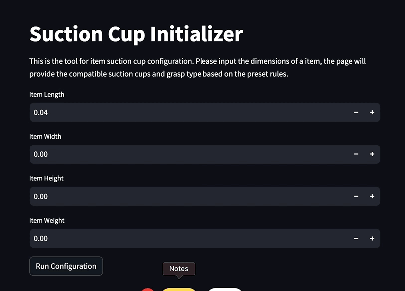

# SuctionCupSelector
The project is for recommending suction cups in piece picking automation process with robotic arms


## Table of Contents
- [Summary](#summary)
- [Install](#install)
- [Features](#features)
- [License](#license)


## Summary

The project contains data analysis and the webpage for user to access the tools. Here is the list of key files and purpose of each file:

* Suction Cup Configuration Automation
    * SuctionCupRules.py - This is the implementation of the suction cup selection rules.
    * notebook.ipynb - This is the Jupyter notebook for demonstrating the process of batch suction cup selection.
* AB Test
    * ABTestToolKit.py - This is the file that contiains the utility functions for AB test analysis.
    * AB_test.ipynb - This is the prerequsite guide for beginner to start AB test
    * PickingDataProcess.ipynb - This is the Jupyter notebook for demonstrating the process of batch AB test analysis.
* Webpage
    * Suction_Cup_Configuration.py - This is the home page of the streamlit webpage.
    * pages/2_AB_Test_Sample_Size_Calculator.py - This is page for sample size calculation.
    * pages/3_AB_Test_Analyzer.py - This is page for AB test.
    * Checkout the webpage at [SuctionCupAnalysisTool](https://suctioncupselector.streamlit.app)

<p align="center">
  
</p>


## Install

### Install the Python Dependency

The project uses Python 3.9. You can create a virtual environment and run the following command to install the required packages.

```cli
pip install -r requirements.txt
```

To run the webpage locally, please run:

```cli
streamlit run Suction_Cup_Configuration.py
```

## Features

Besides the analysis, the webpage provides 3 utilities.

* Suction Cup Initializer
   * Given item dimensions, the tool will spit out the compatible suction cup and grasp type for the item.
* AB Test Sample Size Calculator
   * Given alpha, power, MDE, the calculator can provide the needed sample size per variant under the one-side test assumption.
* AB Test Analyzer
   * Given the sample size and the proportion of control and experiment group, the analyzer can run the test to see if the result is significant or not.
 

## License

This project is licensed under the MIT License - see the [LICENSE](LICENSE) file for details.
